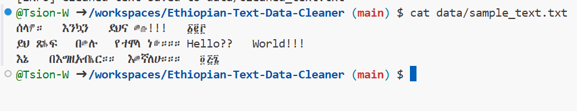
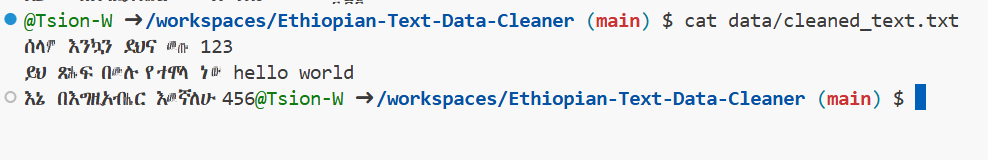
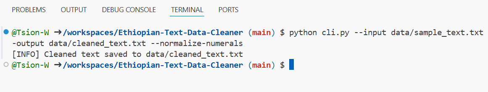

# Ethiopian-Text-Data-Cleaner

## 📖 Overview
A Python-based tool for **cleaning and preprocessing Ethiopian language text data** (Amharic, Geez, etc.) for NLP and analytics projects.  
This project helps researchers, linguists, and data scientists prepare Ethiopian corpora for downstream tasks.

## ✨ Features
- Removes unwanted symbols, punctuation, and extra spaces  
- Normalizes whitespace  
- Supports Amharic, Geez, and mixed-script text  
- Normalizes Geez numerals to Arabic numerals  
- Provides both **Python API** and **CLI** for flexibility  

## 🛠 Tech Stack
- Python  
- Pandas  
- Regex  

## 📸 Demo

### Before Cleaning

### After Cleaning

### Terminal Run

**Sample input text (`sample_text.txt`):**
